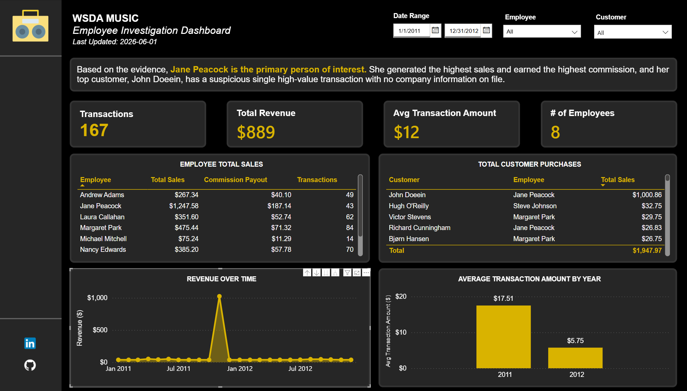

# WSDA Music — Employee Investigation Dashboard

## Overview
This Power BI dashboard investigates employee sales performance and
customer support patterns at WSDA Music using the Chinook database,
a widely-used sample dataset modelling a digital music store.

The analysis surfaces which employees generate the most revenue,
how customer support assignments affect purchasing behavior, and
where revenue concentrations exist by genre and geography.

## Challenge
Perform in-depth analysis with the aim of finding employees who may have been financially motivated to commit a crime. Which employee made the highest commission? Which customer made the highest purchase? Do you see anything suspicious? Who do you conclude is our primary person of interest?

## Data Model
Built on the Chinook database (13 tables). Key relationships:
- Invoice → Customer → Employee (support rep chain)
- InvoiceLine → Track → Album → Artist / Genre
- Date table for time-intelligence measures

See [data/data-dictionary.md](data/data-dictionary.md) for
column-level documentation.

## SQL
Exploratory queries used to validate and shape the analysis
are in [/sql](/sql). Each file is self-documented with a
comment block explaining the business question it addresses.

## Tools Used
- **Power BI Desktop** — data model, DAX measures, report design
- **SQL** — data exploration and validation
- **DAX** — custom measures for revenue, ranking, and time intelligence

## How to Use This File
1. Download `report/WSDA Music Employee Investigation Dashboard.pbix`
2. Open in Power BI Desktop (free download from Microsoft)
3. The embedded dataset loads automatically

## About
Built as part of an extension of the SQL Essentials LinkedIn Learning course. 

[LinkedIn](https://www.linkedin.com/in/emilypchee/) |
[Portfolio](https://seemly-existence-5eb.notion.site/You-got-questions-Emily-Chee-got-answers-02d623d6b64c496e818930e9b725b52c)
